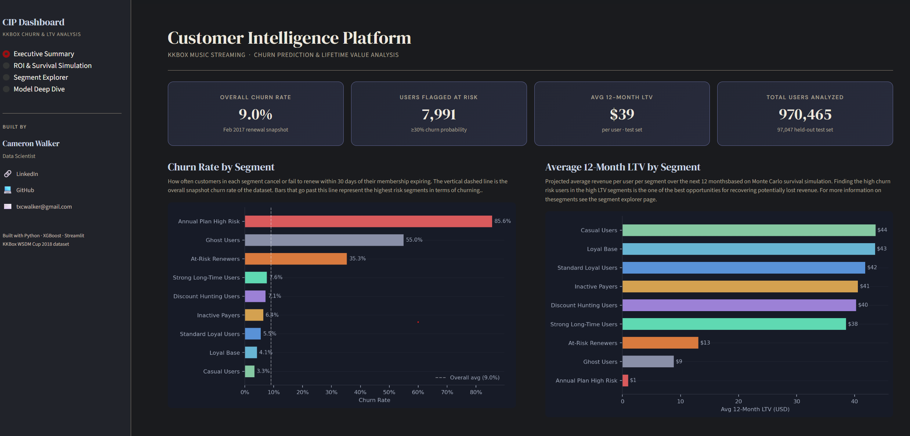

# Customer Intelligence Platform

**Churn prediction and lifetime value analysis for a subscription music streaming service.**

Built on the KKBox WSDM Cup 2018 dataset (~970,000 users), this project demonstrates an end-to-end 
data science workflow — from raw data ingestion through feature engineering, customer segmentation, 
churn modeling, LTV simulation, and an interactive business dashboard.



🔗 **[Live Demo — Coming Soon](#)**

---

## What This Project Does

Most churn projects stop at a model accuracy score. This one goes further — the goal was to answer 
the question a business actually cares about: **if we reach out to at-risk customers, how much 
revenue do we save relative to what we spend?**

To answer that, the project builds a full analytical stack:

- Identifies which customers are likely to churn and ranks them by risk
- Groups all 970,000 users into 8 behaviorally distinct segments using unsupervised learning
- Projects 12-month revenue per user using a Monte Carlo survival simulation
- Calculates per-segment ROI on retention spend under configurable assumptions
- Delivers everything through an interactive dashboard built for both technical and business audiences

---

## Key Findings

**Behavior predicts churn better than demographics.** A model trained only on behavioral signals 
achieved 0.897 AUROC. Adding age, gender, city, and registration channel improved this by just 
+0.004 — a negligible gain that would come at the cost of collecting and processing unnecessary 
personal data.

**One segment drives the intervention case.** At-Risk Renewers churn at 35% but carry meaningful 
lifetime value. They are not abandoning the service — they are simply choosing not to auto-renew 
each cycle. A well-timed nudge has the highest probability of changing their decision, and the 
ROI math supports it.

**Most revenue is stable.** The three largest segments — Standard Loyal Users, Casual Users, and 
Strong Long-Time Users — represent over 60% of the user base with churn rates below 8%. The 
business is not in crisis; the opportunity is targeted retention, not broad intervention.

---

## Technical Highlights

**Calibration over raw AUROC.** The standard approach for imbalanced classification is to upweight 
the minority class during training. Testing confirmed this pushed AUROC close to perfect — but 
produced predicted probabilities that were 15–30 percentage points above actual churn rates. 
A miscalibrated model is useless for downstream LTV and ROI calculations that depend on the 
raw probability output. Removing class weighting cost essentially nothing in AUROC and produced 
near-perfect calibration across all segments.

**Structural vs behavioral churn.** The Monte Carlo simulation separates two distinct churn 
mechanisms: 2.5% monthly unconditional attrition (users who leave regardless of any campaign — 
life changes, forgotten accounts, etc.) and individual behavioral churn derived from each user's 
model-predicted risk. This produces more honest LTV estimates than a simple hazard floor.

**Missingness as signal.** Three binary flags — `has_no_transactions`, `has_no_logs`, 
`has_no_demographics` — were built before any imputation. Absence from a source table is itself 
predictive. Imputing silently and discarding the flag would let the model see filled-in values 
without knowing they were filled in.

**Auto-renewal behavior dominates.** `auto_renew_delta` — the difference between a user's current 
auto-renewal setting and their historical average — was the strongest single predictor across all 
model variants. A user who recently switched off auto-renew after a long history of keeping it on 
is a clear early signal of impending churn that raw renewal status alone misses.

---

## Project Structure

```
customer_intelligence_platform/
├── notebooks/
│   ├── 01_data_ingestion.ipynb
│   ├── 02_feature_engineering.ipynb
│   ├── 03_segmentation.ipynb
│   ├── 04_churn_modeling.ipynb
│   ├── 05_ltv_simulation.ipynb
│   └── 06_eda.ipynb
├── src/
│   ├── data_loader.py
│   ├── features.py
│   ├── segmentation.py
│   ├── model.py
│   └── ltv_sims.py
├── app/
│   └── streamlit_app.py
├── config/
│   ├── config.yaml          # local only — not committed
│   └── config.template.yaml
├── requirements.txt
└── README.md
```

---

## Stack

| Layer | Tools |
|---|---|
| Data processing | Python, pandas, NumPy, PyArrow |
| Modeling | XGBoost, scikit-learn, SHAP |
| Survival modeling | SciPy (Weibull), NumPy (Monte Carlo) |
| Dashboard | Streamlit |
| Visualization | Matplotlib, Seaborn |

---

## Dataset

KKBox WSDM Cup 2018 — available on [Kaggle](https://www.kaggle.com/c/kkbox-churn-prediction-challenge).

~9GB raw, ~970,000 users, transaction history from January 2015 through March 2017. 
Data files are not included in this repository. To reproduce the analysis, download the dataset 
via the Kaggle CLI and update the paths in `config/config.yaml` (see `config.template.yaml`).

```bash
kaggle competitions download -c kkbox-churn-prediction-challenge
```

---

## Setup

```bash
# Clone the repo
git clone https://github.com/txcwalker/customer_intelligence_platform.git
cd customer_intelligence_platform

# Create and activate virtual environment
python -m venv venv
venv\Scripts\activate  # Windows
source venv/bin/activate  # Mac/Linux

# Install dependencies
pip install -r requirements.txt

# Configure paths
cp config/config.template.yaml config/config.yaml
# Edit config.yaml to point to your local data directory

# Run the dashboard
streamlit run app/streamlit_app.py
```

---

## Author

**Cameron Walker** — Data Scientist

[LinkedIn](https://www.linkedin.com/in/cameronjwalker9/) · [GitHub](https://github.com/txcwalker) · txcwalker@gmail.com